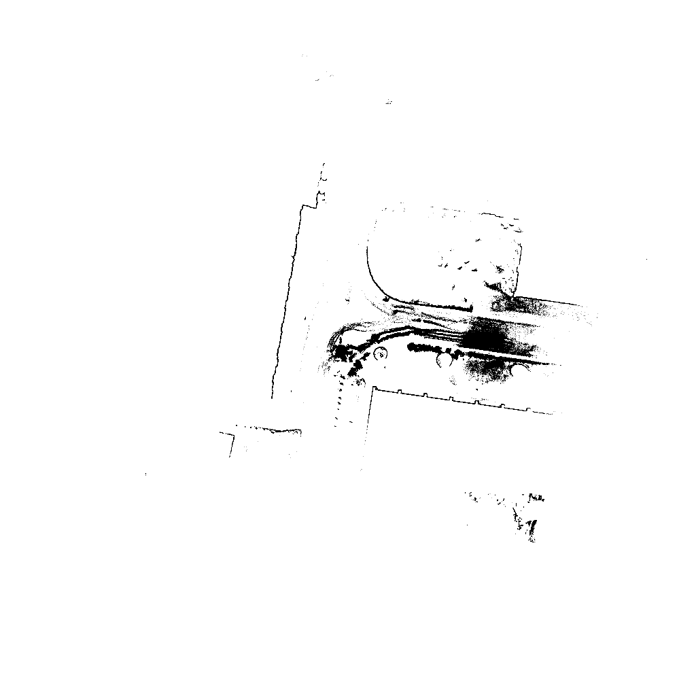

# pointcloud_to_2dmap

```bash
# Usage
pointcloud_to_2dmap input_pcd dst_directory
```

```bash
# Help
pointcloud_to_2dmap:
  --help                                Produce help message
  -r [ --resolution ] arg (=0.1)        Pixel resolution (meters / pix)
  -w [ --map_width ] arg (=1024)        Map width [pix]
  -h [ --map_height ] arg (=1024)       Map height [pix]
  --min_points_in_pix arg (=2)          Min points in a occupied pix
  --max_points_in_pix arg (=5)          Max points in a pix for saturation
  --min_height arg (=0.5)               Min height of clipping range
  --max_height arg (=1)                 Max height of clipping range
  --input_pcd arg                       Input PCD file
  --dest_directory arg                  Destination directory
```


## Navigate into Folder where you want to clone 
```
~$ cd /workspace/
```
## Clone this Repo into your workspace
```
~/workspace$ git clone https://github.com/20-wash/pointcloud-pcd_to_2dmap_image.git
```

## Navigate into Folder 
```
~/workspace$ cd pointcloud_to_2dmap/
```

## Build this repo
```
~/workspace/pointcloud_to_2dmap$ mkdir build  
~/workspace/pointcloud_to_2dmap$ cd build 
~/workspace/pointcloud_to_2dmap/build$$ cmake ..
~/workspace/pointcloud_to_2dmap/build$ make
```

## Run the executable file 
Input_pcd_file_path : ```/home/biswash/ws_livox/src/FAST_LIO/PCD/scans.pcd```

Output_2D_map_path : ```/home/biswash/ws_livox/src/FAST_LIO/PCD/output```

Command: ```pointcloud_to_2dmap Input_pcd_file_path Output_2D_map_path```

```
~/workspace/pointcloud_to_2dmap/build$ ./pointcloud_to_2dmap /home/biswash/ws_livox/src/FAST_LIO/PCD/scans.pcd /home/biswash/ws_livox/src/FAS/home/biswash/ws_livox/src/FAST_LIO/PCD/output

```


